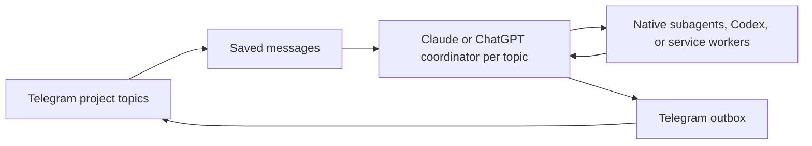

<h1 align="center">
  
  <br>
  <picture>
    <source media="(prefers-color-scheme: dark)" srcset="docs/brand/torii-wordmark-dark.png">
    
  </picture>
</h1>

<p align="center">
  <b>Run your Claude Code and Codex agents from one Telegram chat.</b>
</p>

Torii is a small service that runs on your Mac. It connects you, as the one
paired Telegram owner, to the Claude and Codex command-line agents installed on
that Mac. Each Telegram project topic gets its own long-running Claude or ChatGPT
coordinator. You send a task in plain words; the coordinator plans it, hands
parts to workers, checks their results, and answers in the same topic.

Torii is an independent project. It is not affiliated with Anthropic, OpenAI, or Telegram.

## Why Torii

Coding agents are good at long jobs, but they live in a terminal. Torii puts
them in the chat app you already carry:

- **Away from the desk.** Start, steer, and review work from your phone.
- **One conversation per project.** Each topic has a separate coordinator
  conversation and job list. Coordinators share one memory folder.
- **Keeps talking while work runs.** Workers run in the background. You can
  add instructions mid-task and they arrive in order.
- **Survives restarts.** Messages, tasks, workers, and outgoing replies are
  kept in SQLite, so a relaunch picks up where it left off.

## Features

- **A coordinator per topic.** Each project topic has its own persistent
  Claude or ChatGPT coordinator session that resumes after a relaunch.
- **Claude and Codex workers.** The coordinator delegates to native Claude
  subagents, Codex, or background service workers, and checks what they claim.
- **One worktree per task.** Each committed task gets its own Git branch
  (`torii/task-<id>`) and worktree, so parallel tasks do not collide.
- **Attachments and voice.** Send images, files of any type, and voice notes.
  Voice notes are transcribed locally on the Mac.
- **Several accounts.** Add Claude and Codex accounts from Telegram. Torii
  tracks their usage and can move work to another account at a limit.
- **Private credentials.** Send a credential through a secure card. Torii
  stores accepted values in an encrypted local vault and keeps them out of
  its work-message records and prompts. Tap **Fill privately** to use the bot DM.
  See [credential transport and deletion](docs/setup.md#setup).
- **Settings in Telegram.** `/accounts` shows usage, sign-ins, and resets.
  Its **Models & Codex ›** button opens model and delegation settings.
  `/projects` manages projects. `/health` shows running agents and system load.
- **Status at a glance.** Torii reacts to your message: 👀 when the coordinator
  takes it on, 👨‍💻 or 🤔 when a worker starts coding or researching, and 👌 when
  the job is done.

## Requirements

- A Mac with macOS 13 or newer and Git. Install Git with Apple's
  [Command Line Tools](https://developer.apple.com/documentation/xcode/installing-the-command-line-tools)
  by running `xcode-select --install` in Terminal.
- [Python 3.9 or newer](https://www.python.org/downloads/macos/). Torii's core
  has no third-party Python dependencies. Check `python3 --version` before setup.
- [Claude Code](https://code.claude.com/docs/en/setup), the `claude` command,
  or the [Codex CLI](https://developers.openai.com/codex/cli), the `codex` command.
  Use an account with access to the selected provider and model. Connect Claude
  or ChatGPT in Accounts.
  Claude is preferred when available, with model `claude-opus-5-5`. Otherwise the
  main chat uses the active ChatGPT account and Codex model, default `gpt-6.1-sol`.
  ChatGPT accounts never switch automatically for the main chat.
  Saved secrets and worker goals work with Claude and ChatGPT workers.
- A new Telegram bot made with `/newbot` in @BotFather just for Torii. Using a
  bot that another program polls interrupts that program.
- A Mac that stays awake and online. A sleeping Mac does not answer.

Voice notes are optional. Local voice transcription requires macOS 14 or newer
on Apple silicon and installs a separate environment and model on first use.
See [voice setup](docs/setup.md#messages-and-reports) and
[native CLI capability checks](docs/operations.md#native-cli-contract).
Setup checks CLI availability, not a minimum CLI version.

## Install and first run

1. Ask your local agent to set up Torii, using this prompt:

   ```text
   Set up Torii on this computer. Follow the instructions at
   https://github.com/pnkfluffy/torii/blob/main/docs/agent-setup.md
   Never ask me for my Telegram bot token.
   ```

   It clones Torii, checks this Mac, guides you through BotFather, and opens
   the setup window in Terminal. If it cannot open Terminal, it gives you one
   command to run there. It never asks for your bot token.

2. Or install by hand:

   Install the Command Line Tools, Python, and at least one provider CLI from the
   official links in [Requirements](#requirements). Open a new Terminal window
   after installation. Check `git --version`, `python3 --version`, and
   `claude --version` or `codex --version` before cloning.

   ```sh
   git clone https://github.com/pnkfluffy/torii.git ~/torii
   cd ~/torii
   python3 scripts/setup.py
   ```

   The token prompt is hidden. Do not put the token in an agent chat or a command.
   The installer saves the absolute path of the Python interpreter that runs
   setup in the LaunchAgent. To select another Python 3.9+ interpreter, replace
   `python3` with its absolute path. Keep that interpreter installed.
   `TORII_PYTHON` overrides the offline verifier's interpreter, not the installer.
   Set it to the saved path when verifying a custom-Python installation.

3. In Telegram, pick a group you own and tap **Add as admin**. If Telegram did
   not open, use the printed link. No group yet? Create one before opening it.
   Keep **Manage topics**, **Delete messages**, and **Pin messages** enabled.

4. If asked, turn on **Topics** under the group name → **Edit**, then tap
   **Check again**. Continue in the **Torii** topic and tap **Add ChatGPT** or **Connect Claude**.
   Follow the sign-in card in your browser; paste a code in that topic if Claude asks.
   Send your first request in **Torii**, then choose its project name.

Each project starts under `~/Projects/torii` and gets its own group topic.
Torii holds work until Claude or ChatGPT is connected. Either can run the main chat.
Existing group installs keep working. The bot DM is only for secrets and sign-in
codes. [Setup reference](docs/setup.md) covers setup and terminal alternatives.

## Daily use

| Action | How |
| --- | --- |
| Give or steer work | Send a message in an enabled project topic. |
| Answer a question | Reply to the coordinator's message. |
| Set a long verification goal | `/goal CONDITION` |
| List or create projects | `/projects`, then **New project**, **Projects folder**, or **This topic ›** |
| Add or inspect accounts | `/accounts`, then **Add Claude** or **Add ChatGPT** |
| Set models and delegation | `/accounts`, then **Models & Codex ›** |
| Catch up on this topic | `/tldr` |
| See running agents and system load | `/health` |
| Manage stored credentials | `/secrets`, then a name and **Rotate**, **Revoke**, or **Ask again** |
| Check the connection | `/ping` |
| See the command list | `/help` |
| Inspect tasks and workers on the Mac | `python3 -m coordinator status` |
| List local control operations | `python3 -m coordinator ctl list` |

The command menu has seven commands, all without arguments. `/help` is a plain
list with no buttons. `/setup` and `/start` still handle pairing and project
linking, but stay out of the menu. The full command list is in
[Telegram controls](docs/operations.md#telegram-controls).
See [Update Torii](docs/operations.md#update-torii) and
[Uninstall Torii](docs/operations.md#uninstall-torii) for service maintenance.

## How it works



1. The service polls Telegram, accepts only the paired owner, and saves each
   message in SQLite before anything acts on it.
2. It hands each saved message, in order, to that topic's coordinator. Messages
   sent while a turn runs are delivered too.
3. The coordinator answers directly, or commits to a task and delegates it.
   Worker results come back to the coordinator as messages.
4. Replies go through a saved outbox. A delivery retry never reruns an agent.

Every coordinator and worker runs under its own detached host, so restarting
the service interrupts no agent. On relaunch Torii reattaches to live hosts or
resumes each topic's exact native session. It does not blindly rerun work that
may have partly happened. See [Architecture](docs/architecture.md) and
[Coordinator and delegation](docs/orchestration.md).

## Safety model

Torii is a trusted, single-owner tool. Read the [access model](SECURITY.md)
before you enable agents.

- **Agents have your permissions.** Claude workers run with
  `--dangerously-skip-permissions`. Codex app-server threads use
  `approvalPolicy="never"` and `sandbox="danger-full-access"`; the separate
  exec path uses `--dangerously-bypass-approvals-and-sandbox`. They can read and change
  anything your macOS account can. A Git worktree is not a sandbox.
- **Only you can give work.** An expiring, one-use pairing code binds your
  numeric Telegram ID and the group you own. Other users, bots, edited messages, and
  anonymous admins cannot submit work. New topics stay disabled until bound to a project.
- **Credential handling.** Claude profiles keep their own sign-in. Torii never
  reads or passes Claude sign-in tokens. The bot token, state, and logs live outside the
  repository with private permissions. Credentials go through the private chat
  into an encrypted vault. Claude and ChatGPT job workers receive only the
  secrets their task declares, through their own process environment. The
  coordinator receives names and metadata only. Codex secret workers require
  a private app-server and checked launch controls that disable shell snapshots,
  memory generation, native subagents, and tool-output telemetry. Captured-output
  scrubbing has limits, and native history can retain values a tool prints.
  See [Credentials](docs/operations.md#credentials).
- **No silent reruns.** After a restart, Torii reports uncertain work to the
  coordinator instead of repeating it.

## Docs

- [Setup reference](docs/setup.md): models, effort, usage policy, worktrees
- [Operations](docs/operations.md): controls, accounts, credentials, logs, troubleshooting
- [Architecture](docs/architecture.md): request flow, recovery, stored state
- [Coordinator and delegation](docs/orchestration.md)
- [Control API](docs/control-api.md)
- [Pinned release](docs/release.md)
- [Verification](docs/verification.md): the offline test baseline
- [Access model](SECURITY.md) and [Contributing](CONTRIBUTING.md)

To run the offline checks from this checkout:

```sh
/usr/bin/python3 ./scripts/verify-local.py
```

The verifier defaults to `/usr/bin/python3`. For an installation using another
interpreter, run `TORII_PYTHON=/absolute/path/to/python3 ./scripts/verify-local.py`.
Use the interpreter saved in the LaunchAgent's first `ProgramArguments` entry.
The checks use fake Telegram and provider processes in scratch state and do not touch
a running service.

## Shared MCP servers

Claude coordinators and workers can share MCP servers from your
`~/.claude.json`. The list is opt-in and empty by default; add server names to
the checkout's gitignored `local-overrides.json`:

```json
{"shared_mcp_servers": ["example-mcp"]}
```

See [Setup reference](docs/setup.md#shared-mcp-servers) for the rules.

## License

MIT. See [LICENSE](LICENSE). The Claude and Codex CLIs and services have their
own terms.
